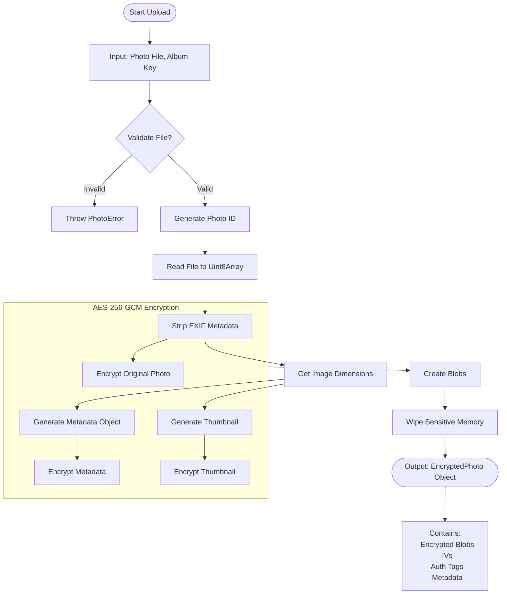

# Encryption Process Flowchart

This document illustrates the **existing** encryption and decryption processes for photos in Famoria.

## Photo Encryption Workflow
*File: `services/crypto/photo/photoEncryption.ts` -> `encryptPhoto`*



## Detailed Encryption Steps
1. **Validation**: Checks file size (max 50MB) and format (JPEG, PNG, WebP, HEIC).
2. **Preprocessing**:
   - Reads file into memory.
   - Strips EXIF data for privacy (`piexif`).
   - Generates a thumbnail (`canvas`).
   - Extracts image dimensions.
3. **Encryption (AES-256-GCM)**:
   - Uses `crypto.subtle.encrypt`.
   - Generates unique 12-byte IV for each item.
   - Produces 128-bit Authentication Tag.
   - Encrypts: Original Photo, Thumbnail, Metadata (JSON).
4. **Cleanup**: Wipes sensitive arrays from memory using `wipeMemory`.

---

## Photo Decryption Workflow
*File: `services/crypto/photo/photoEncryption.ts` -> `decryptPhoto`*

```mermaid
flowchart TD
    StartDecrypt([Start Decryption]) --> InputsDecrypt[Input: Encrypted Blob, IV, Auth Tag, Album Key]
    
    InputsDecrypt --> ReadBlob[Read Blob to Uint8Array]
    
    subgraph Decryption [AES-256-GCM Decryption]
        ReadBlob --> Reconstruct[Reconstruct Ciphertext + Auth Tag]
        Reconstruct --> Decrypt[Decrypt using Key & IV]
    end
    
    Decrypt -- Success --> OutputDec([Output: Decrypted Data (Uint8Array)])
    Decrypt -- Failure --> ErrorDec[Throw Decryption Failed Error]
    
    OutputDec --> Display[Create Object URL for Display]
```

## Detailed Decryption Steps
1. **Input**: Receives the encrypted blob (from storage/cache), IV, Auth Tag, and the Album's CryptoKey.
2. **Reconstruction**: `decryptAES256GCM` expects the auth tag appended to the ciphertext.
   - *Note*: The storage format separates them, so they are combined before passing to `crypto.subtle.decrypt`.
3. **Decryption**:
   - Uses `crypto.subtle.decrypt`.
   - Validates the Auth Tag (integrity check).
4. **Output**: Returns the raw decrypted bytes, which are then converted to a Blob/Object URL for the `` tag.
